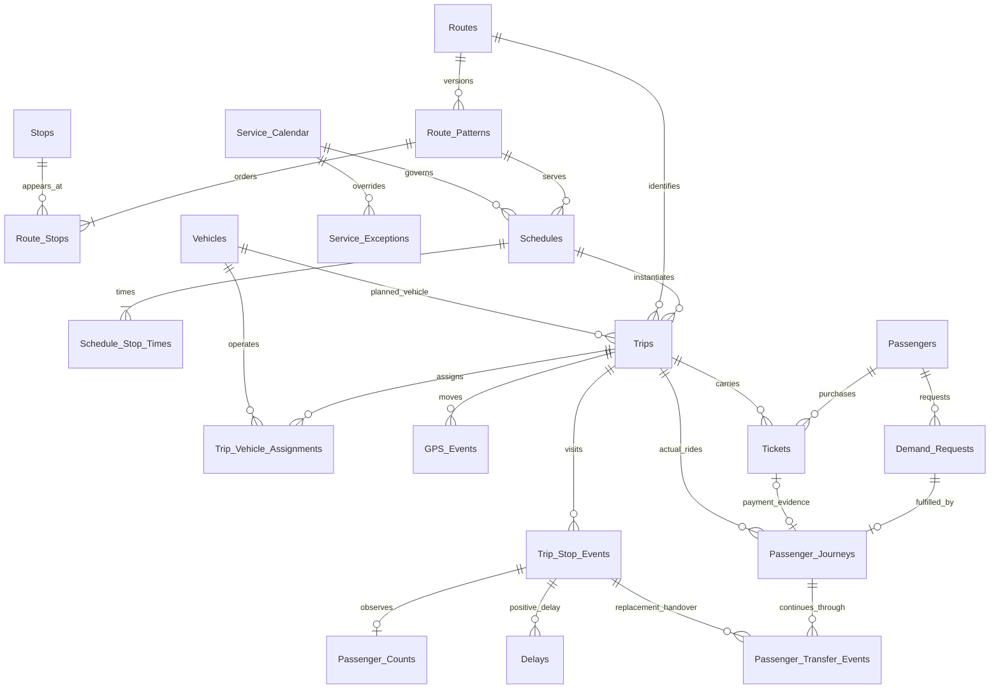

# UrbanTransit IQ dataset architecture

Design version 2, 2026-09-24. **DESIGN ONLY — no records, generator, cleaning, Spark jobs or models have been implemented.**

## Authority and document map

The authoritative source is [the official SRS v1.0](UrbanTransit%20IQ-Data%20Science%20Intelligence%20Arena_SRS.pdf), read directly in the prior analysis; this revision is a focused design correction. Page references below mean physical PDF pages including cover/contents. The PDF is local, ignored by Git, and is not a submission artifact. The [data dictionary](DATA_DICTIONARY.md) defines field-level contracts; the [generation plan](DATA_GENERATION_PLAN.md) defines future generation, injection, audits and the source-to-design gap register. The official PDF is the sole requirements authority. [MASTER_SRS_CHECKLIST.md](../MASTER_SRS_CHECKLIST.md) is a derived tracker; these three documents are implementation designs and cannot override the PDF.

All table sizes above official minima, time windows, distributions, rates, thresholds, names, safety floors and formulas in these documents are **PROJECT DESIGN CHOICES**, not newly asserted SRS mandates. MUST/SHOULD/MAY retain the interpretation recorded in the master checklist. The source says connected tables and realistic conditions “such as”; we elect to cover every named example without changing its normative status. The SRS does not explain how its transformation/integration/augmentation warning applies to a wholly synthetic source; the design uses original cross-channel generation, integration and augmentation as a conservative, visible interpretation rather than claiming a new external-data requirement. This design intends full dataset requirement coverage; runtime compliance remains unproven until implementation and validation.

## Direct extraction from the PDF

| SRS reference | Faithful source requirement and modality | Design response |
| --- | --- | --- |
| §1.2 Step 1, pp.7–8 | MUST create own large-scale interconnected dataset. Expected content: tickets, passenger entries/exits, routes, route stops, trips, scheduled/actual arrivals/departures, vehicle assignments/capacity, passenger counts, delays, stops, route distance, service calendars, fares, locations, GPS or simulated movement. Suitable identifiers MUST be used; listed ID names are examples. | All twelve named entities plus justified operational and audit extensions below; dictionary specifies exact grains and keys. |
| Hint p.29 | MUST contain each of the eight numerical minimums and multiple service calendars/schedules reproduced in the scale table below. | Independently count each after cleaning; do not sum unlike grains or inflate counts with duplicates. |
| Hint pp.29–31 | MUST have connected tables such as Passengers, Tickets, Routes, Stops, Route_Stops, Trips, Schedules, Vehicles, Passenger_Counts, Delays, GPS_Events, Service_Calendar. MUST include difficult/realistic conditions such as the 21 listed examples. MUST submit generation scripts; ready-made data without significant transformation, integration and augmentation does not satisfy. | All twelve named entities and all 21 examples are covered by a fully generated, reproducible design. The SRS does not require a hybrid or external dataset; the generation plan records original transformation, integration and augmentation methodology without assuming a public source. |
| Steps 2–3, pp.8–9 | MUST demonstrate HDFS, CSV, JSON, Parquet; relational OR NoSQL where required. At least one large analytical dataset MUST be Parquet. Ingest with Spark OR PySpark; demonstrate multiple files, explicit schemas, schema inference, large loading, partitioning, type validation, HDFS and Parquet reading. | Storage/ingestion contracts below; no HDFS operation in this phase. |
| Step 4 p.9 | MUST detect missing tickets, missing route IDs, invalid stop IDs, duplicate tickets, duplicate trips, negative counts, invalid timestamps, impossible arrivals, departure before arrival, capacity violations, invalid delay values, missing vehicle assignments, broken stop sequences, invalid distances, unknown passengers, missing trips. MUST generate Data Quality Report. | Sixteen rule families in generation plan, with retained evidence. |
| Step 5 p.10 | MUST clean/correct/flag/remove/quarantine with documented rules and retain original record, issue, rule, corrected value and final status. | Immutable raw envelope + DQ_Issues + DQ_Record_Outcomes; no destructive raw removal. |
| Step 6 p.10 | MUST integrate with Spark SQL OR PySpark joins; ten expected joins listed below. | Cardinality-safe join contracts and effective-date checks. |
| Step 7 pp.10–11 | MUST engineer analytical features; 24 listed feature examples are covered in the analytics mapping below. | Field-level derivability, denominator and availability contracts. |
| Steps 9–15 pp.12–15; Steps 17–49 pp.15–26 | Passenger flows, OD, demand-derived peaks, persistent overcrowding, underutilization, performance, delays, forecasts, clustering, anomaly detection, evidence-backed actions and what-if support. | Movement, count, temporal, schedule, demand and context records; mapping below. |
| Hint p.31; Steps 23–24 p.18 | MUST use suitable training/validation/testing sets; chronological time-dependent validation and no future leakage; forecast MUST beat documented simple baseline. Forecast metrics SHOULD include MAE/RMSE/MAPE and R² where appropriate. | Frozen chronological manifests, as-of availability, purged horizon boundaries; success is not asserted by design. |
| Steps 41–44 pp.23–24; §1.8 pp.40–41 | Independent Spark MLlib and Python pipelines MUST independently solve at least one major task; no copying Spark predictions; at least 100 unseen cases compared. Hidden data will be supplied and may contain ten listed irregularities. | Independent reads of equivalent raw snapshot and shared case IDs; hidden challenge batch contract. |
| §1.10(3) pp.45–46 | MUST submit generation scripts, dictionary, schemas, PK/FK definitions, raw sample, cleaned data, Parquet data, training/validation/test data and dataset statistics. | Explicit artifact acceptance mapping in generation plan; artifacts other than planning docs still need implementation. |

## Entity model and why extensions exist

**Twelve SRS-named tables:** Passengers, Tickets, Routes, Stops, Route_Stops, Trips, Schedules, Vehicles, Passenger_Counts, Delays, GPS_Events, Service_Calendar.

**Eleven project extensions (nine operational/data-contract extensions plus two audit extensions):**

| Extension | Necessary benefit; why not overload another grain |
| --- | --- |
| Route_Patterns | Versioned ordered route/direction geometry; old trips retain old stop sequences after new stops or route changes. |
| Schedule_Stop_Times | Stop-by-stop scheduled offsets for a reusable schedule; supports dwell, punctuality and stop delays. |
| Trip_Stop_Events | Actual per-trip stop arrival/departure and stop outcome, independent of passenger counts. Preserves cancellations/skips and actual movement. |
| Trip_Vehicle_Assignments | Planned/actual vehicle and capacity history across stop ranges; supports replacements without using future capacity. |
| Service_Exceptions | Date-specific holiday/add/remove exceptions to recurring calendars. |
| Passenger_Journeys | One actual passenger–trip ride, with boarding/alighting and OD; clearly covers passenger-level interpretation of “trip-level passenger records”. |
| Passenger_Transfer_Events | One continuing passenger transfer at a vehicle-replacement stop, linked to the same journey and handover; preserves replacement traceability without creating demand. |
| Demand_Requests | Intended travel including unserved requests and queue-entry time; prevents treating only served ticket sales as total demand. |
| Context_Events | Scheduled special events versus unplanned disruptions, with locations/time and when information became available. |
| DQ_Issues | One detected rule issue per physical source row/run, preserving original and proposed corrected values. |
| DQ_Record_Outcomes | One final disposition per affected source row/run only; unchanged valid rows use run/table reconciliation, not individual audit outcomes. |

Twenty-three logical tables in total. Manifest/schema/rule catalogs are small control documents, not additional transport entities. The current project choice is a fully generated, reproducible dataset: fictional topology, calendars, operations, passengers and context produced by original scripts. No external dataset is required or selected. The SRS does not require a hybrid source strategy; any future public input would need a separate reviewed decision and would still have to meet the SRS transformation/integration/augmentation condition. No real passenger identity or ticket trail is planned.

The diagram omits repetitive audit/stop FKs for readability; the dictionary is definitive. Tickets intentionally do not point back to journeys, avoiding a circular insertion dependency. Missing ticket references are nullable/flagged in otherwise observed journeys; they are not invented to repair sales. Every count and delay is tied to a valid stop event; vehicle assignments are phase-specific and may be explicitly UNKNOWN with null canonical FKs. `Passenger_Transfer_Events` is a replacement-only ledger: its rows point to the continuing journey and handover, and are never ordinary boardings, alightings, new OD movements or extra journeys. This preserves non-vehicle evidence without permitting occupancy or vehicle attribution when assignments/capacity are unknown. FKs in immutable raw data may deliberately fail; typed accepted data must meet the declared contract or carry the specifically allowed unresolved state, never silent fabricated references.

## Scale: exact SRS minimum versus project target

The project target is sized for the supplied VM (4 CPU, 8 GB RAM and approximately 100 GB disk) while leaving a measurable margin above every numerical SRS minimum. It is a target, not a claim that the SRS requires 18 months or any particular row count. The canonical passenger-movement population is **2,400,000 unique served rides** before controlled defects, with a matching ticket view. The two tables describe the same rides and must never be added together to claim 4.8 million movements. Duplicate physical ticket copies, plan revisions, stop observations, GPS points and transfer events are not additional movements.

| Metric | SRS MINIMUM (exact wording) | PROJECT TARGET / population | Post-cleaning publication gate (project unless marked SRS) |
| --- | --- | --- | --- |
| Ticketing or movement | At least 2,000,000 ticketing or passenger movement records | 2,400,000 unique Passenger_Journeys and 2,400,000 matching unique Tickets; raw tickets may include append-only duplicate copies | ≥2,300,000 usable unique journeys and ≥2,300,000 usable unique tickets; count the movement minimum once using the canonical rule below, never by summing the two views |
| Trip-level passenger records | At least 500,000 trip-level passenger records | 2,400,000 passenger–trip journey rows; approximately 2,352,000 observed Passenger_Counts stop observations | ≥2,300,000 usable journey rows and ≥2,250,000 usable count observations, including ≥500,000 nonzero count observations; report each grain separately because the SRS does not define this phrase |
| Routes | At least 100 routes | 120 unique Routes: 100 initial, 10 added in July 2025 and 10 added in April 2026 | ≥110 valid routes with actual recorded operation; never count pattern versions as routes |
| Stops | At least 500 stops | 650 unique Stops: 550 initial, 50 added in July 2025 and 50 added in April 2026 | ≥600 valid used stops; do not count the same stop on many routes more than once |
| Vehicles | At least 250 vehicles | 320 unique Vehicles, at least 280 available at the start of service | ≥300 valid vehicles with actual assignments; capacity snapshots are not new vehicles |
| Unique passengers | At least 50,000 unique passengers | 80,000 synthetic Passengers, at least 60,000 active in the first month | ≥75,000 distinct valid passengers with usable journeys; not just unused dimension rows |
| History | At least 12 months of historical operation | 18 complete months: 2025-01-01 through 2026-06-30 inclusive, using local service dates | All 18 months retain usable records; audit continuous coverage, not just two endpoint timestamps |
| Delay records | At least 250,000 delay records | 300,000 distinct positive arrival/departure delay observations at late stop events; approximately 12.8% of operated stop events | ≥280,000 valid positive delay records; no padding with on-time or duplicate records |
| Calendars/schedules | Multiple service calendars and schedules | 12 calendars, about 2,600 schedule versions and date-specific exceptions | ≥10 valid calendars and ≥2,400 usable schedules; “multiple” remains the official wording and no invented SRS count is asserted |

The 2.4 million-ride target is deliberately above the SRS movement minimum but below a multi-million-row all-stop GPS design. It is large enough for route/stop/OD, delay, travel-time, headway, crowding and forecasting work while allowing month/chunk processing on the VM. The project does not claim that the SRS requires this target or that the target proves the 10-million-record scalability objective; that objective remains a later measured test.

Safety is enforced with measured counts, not assumed percentages. Protect a disjoint baseline cohort sufficient for every numerical SRS minimum across all 18 months from destructive corruption; realism still applies to this cohort. Inject missing-ID/parent defects mostly in bounded challenge copies or nonprotected fact records. Bound transitive dependent-row loss for each corruption; do not delete dimension parents and accidentally orphan large facts. If any publication gate fails, fail the future generation run, revise seed/configuration and regenerate a versioned batch; do not silently relabel invalid records or manufacture repairs from generator truth.

| Table | Proposed baseline row count; injection copies excluded unless stated |
| --- | --- |
| Passengers | 80,000 |
| Tickets | 2,400,000 before controlled omission/corruption; about 12,000 append-only duplicate copies of retained originals in raw |
| Routes | 120 |
| Stops | 650 |
| Route_Patterns | About 320 route/direction/version combinations |
| Route_Stops | About 6,400 (mean 20 stops per pattern) |
| Service_Calendar | 12 |
| Service_Exceptions | About 240 date/calendar overrides |
| Schedules | About 2,600 immutable service-template versions |
| Schedule_Stop_Times | About 52,000 (mean 20 stops per schedule) |
| Trips | 120,000 stable operational departures; approximately 126,000 plan-version rows including 6,000 superseded versions (5% one-revision allowance); 2,400 final cancellations (2%), 117,600 operated departures |
| Trip_Vehicle_Assignments | About 248,304: 126,000 version-specific planned + 117,600 initial actual + 4,704 replacement segments (4% of operated departures) |
| Trip_Stop_Events | About 2,520,000 plan-version stop rows (126,000 × 20); 2,400,000 applicable scheduled visits, approximately 2,352,000 observed visits; superseded/cancelled rows never inflate observed counts |
| Passenger_Counts | Approximately 2,352,000 observed trip-stop passenger counts; explicit skips/early terminations may lower the final count |
| Passenger_Journeys | 2,400,000 before controlled corruption/omission, one actual passenger per trip ride |
| Passenger_Transfer_Events | Approximately 70,000 continuing-passenger replacement transfers (about 4,704 handovers × ~15 continuing riders); not movements, boardings or alightings |
| Demand_Requests | About 2,500,000: 2,400,000 served plus about 100,000 unserved/abandoned |
| Delays | About 300,000 unique positive late-stop observations before controlled corruption |
| GPS_Events | About 450,000: three anchor observations per operated departure (352,800) plus approximately 97,200 targeted corridor/replacement/bunching/delay observations; no all-stop high-frequency GPS stream |
| Context_Events | About 180 event/disruption records |
| DQ_Issues | Estimated 100,000–400,000 issue rows per pipeline/run; actual volume is measured, not a quota |
| DQ_Record_Outcomes | Estimated 80,000–300,000 affected-row outcomes per pipeline/run; no row for unchanged valid input |

These are planning estimates, not observed results. Eighteen complete months contain 546 days. 120,000 operational departures give about 220 network trips/day; 2,400,000 rides / 117,600 operated departures is about 20.4 boardings per operated departure. This is a mixed feeder/corridor network, not dense all-day service on every route. Concentrate repeated service, peaks and bunching on selected corridors while retaining sparse feeder/social-service routes. Use 16–24 stops per pattern (mean 20) and 25–90-person vehicle capacities. Passenger profiles, OD turnover and concentrated loads must reconcile to these totals; about 30 rides per passenger over 18 months means daily commuters are a subset, not every passenger.

Plan-version rows are not additional trips. Changes in the 5% revision allowance affect storage rows, not the 120,000-departure target or actual movement counts. Schedule/calendar expansion must produce those operational departures. With a maximum 4% total unique loss after dependencies, the conservative usable floors are 2,304,000 journeys/tickets, 2,257,920 observed count rows and 288,000 positive delays, above the project publication gates and SRS minima. All unique SRS entity minima and complete-month coverage remain independently enforced. Do not count unchanged duplicate representations, superseded plans, transfer movements or GPS points as extra passenger journeys.

### Canonical movement-count rule

`Passenger_Journeys` is the canonical passenger-movement view for this design. `Tickets` is a separate ticketing/payment view of the same baseline rides, not an additive population. The SRS minimum is reported once as the greater of (a) distinct usable journey IDs and (b) distinct usable ticket IDs, with the chosen view named; a run may publish both counts and their overlap, but must never add them. A missing ticket does not erase a confirmed journey, and a ticket without a usable journey remains ticketing evidence rather than silently becoming a second movement. Requests, counts, GPS, stop visits, replacement transfers, plan versions and duplicate physical representations are never counted as additional passenger movements. This rule is a project counting convention; the SRS does not define the precise overlap/grain, so the ambiguity remains visible in the checklist.

### Planning split envelopes

The split is chronological and complete, not a blind multiplier of an earlier estimate. The following are deliberately rounded service envelopes; final counts are measured by service month after validation and include route/stop expansions and seasonal variation.

| Major population | TRAIN (Jan–Dec 2025) | VALIDATION (Jan–Mar 2026) | TEST (Apr–Jun 2026) | Whole-history target |
| --- | ---: | ---: | ---: | ---: |
| Operational departures | ~80,000 | ~20,000 | ~20,000 | 120,000 |
| Unique journeys / ticket view | ~1,600,000 / ~1,600,000 | ~400,000 / ~400,000 | ~400,000 / ~400,000 | 2,400,000 / 2,400,000 |
| Observed stop-count rows | ~1,568,000 | ~392,000 | ~392,000 | ~2,352,000 |
| Positive delay rows | ~200,000 | ~50,000 | ~50,000 | 300,000 |
| GPS observations | ~300,000 | ~75,000 | ~75,000 | 450,000 |

The envelopes are reconciled to 2%/4% loss budgets after the split, not used to claim that every month has identical demand. Superseded plan versions and all representations of one `operational_departure_id` remain in one split group; label windows crossing a boundary are purged or assigned to the later eligible split.

## History, changes and chronological validation

**PROJECT DESIGN CHOICE:** 2025-01-01 through 2026-06-30 inclusive, with exclusive end 2026-07-01: 18 complete operational months. The official SRS minimum remains **At least 12 months of historical operation**. Local service timezone is Asia/Karachi for a fictional network; event/availability instants are UTC. Service-day offsets handle overnight trips independently of UTC dates.

| Partition | Local service/label period | Operational changes |
| --- | --- | --- |
| TRAIN | 2025-01-01–2025-12-31 | 100 initial routes and 550 initial stops; add 10 routes/50 stops in July 2025; seasonal/weekend/event variation and schedule revisions |
| VALIDATION | 2026-01-01–2026-03-31 | New schedule versions and disruptions; model/threshold selection, no fitting of preprocessing on validation data during selection |
| TEST | 2026-04-01–2026-06-30 | Add final 10 routes/50 stops in April 2026, giving 120/650 totals; locked evaluation, including cold-start groups |
| CHALLENGE | Separate later/as-supplied batch | New/unknown entities, malformed records and unseen patterns; no fitting on hidden outcomes |

The 320 pattern versions comprise 240 initial route/direction versions for the 120 routes plus approximately 80 revisions. Revised patterns/schedules retain old snapshots and reference valid stop occurrences; new entities cannot operate before opening. See the dictionary for the stable operational departure identity and plan revision contract.

Chronological split membership is based on the complete target interval and knowledge cutoff, not file order. Keep all plan versions, actual visits, journeys, raw duplicates and representations of one operational_departure_id in the same group. A straddling group/label horizon is purged from the earlier split or assigned to the later eligible split. For aggregate cases, reject any target window that crosses a split boundary. Boundaries are local midnight converted to explicit UTC instants in the split manifest; the final exclusive label cutoff is 2026-07-01 local midnight. Each prediction case records `prediction_cutoff` (normally equal to its issue time) explicitly. Censor later outcomes rather than filling them with future truth.

For every predictive feature, **value_available_at <= prediction_cutoff**. Record event_time, ingestion_time, correction_time and value_available_at separately. Corrected values must respect their own correction time and all supporting evidence availability. For an aggregate or lag feature, availability is the maximum availability of every input value used; a corrected input cannot be hidden by an earlier aggregate timestamp. A current corrected dataset alone is not a historical feature store: preserve pre-correction value revisions or mask the value at earlier cutoffs. Do not backdate a repair performed later merely because the original event happened earlier. Planned information may be used only from a snapshot genuinely received by the cutoff. No future actual load, GPS, outcome, replacement or disruption is a pre-trip feature. Generator latent profiles, scenario labels and audit decisions are excluded from model features.

During model selection fit encoders, imputers, scalers, cluster references and learned thresholds on TRAIN only, with expanding chronological folds inside TRAIN. Use historical lags rather than centered/full-history aggregates. For the primary evaluation retain those fitted models after validation selection; no train+validation refit is assumed. Produce scheduled rolling-origin forecasts with frozen model/preprocessing parameters; only observations actually available at each issue time enter lag features. A separate fixed-origin forecast uses only information available at its declared initial issue time. Label each protocol and never combine their scores. No model/threshold/generator tuning on TEST outcomes. Twelve training months provide one annual cycle, useful but not proof of stable multi-year seasonality.

Project comparison cohort: **at least 1,000 unseen TEST cases**, selected deterministically before model fitting from pre-known attributes and common IDs; SRS minimum remains **at least 100 unseen cases**. Reserve valid comparable cases without excluding difficult cohorts from separately reported coverage metrics. Both pipelines must use the same case truth and report missing/unscorable cases, numerical differences, match/mismatch, probability/value, consistency, disagreement explanations and overall agreement. No fitted models, fitted preprocessing, predictions or derived model outputs pass between pipelines.

Later ML acceptance remains visible: classification should target **at least 85% test accuracy OR macro-F1 >=0.80 where appropriate** (§1.7 p.39; retain conditional/target wording under its blanket functional/non-functional requirement). Forecasting **must measurably outperform a documented simple baseline** (Step 24 p.18), with appropriate MAE/RMSE/MAPE and R² where applicable. At least three suitable delay models and at least three suitable Spark algorithms are evaluated as specified in Steps 19/41; algorithm examples are choices. No results are claimed or fabricated.

## Required joins and cardinality safeguards

| Step 6 expected join | Exact key path / grain and validation |
| --- | --- |
| Tickets → Passengers | Tickets.passenger_id → Passengers.passenger_id (many:one); report unknown/null raw references |
| Tickets → Trips | Tickets.trip_id → Trips.trip_id (many:one); validate passenger journey consistency |
| Trips → Routes | Trips.route_id → Routes.route_id (many:one); route must match Trips.pattern_id's parent |
| Trips → Vehicles | Trips.planned_vehicle_id → Vehicles.vehicle_id (many:one); actual segment capacity via Trip_Vehicle_Assignments, not current vehicle defaults |
| Trips → Schedules | Trips.schedule_id → Schedules.schedule_id (many:one); calendar/date/pattern compatibility |
| Routes → Route_Stops | Routes → Route_Patterns → Route_Stops; route_id repeated in Route_Stops for direct join with equality constraint; select relevant pattern version first |
| Route_Stops → Stops | Route_Stops.stop_id → Stops.stop_id (many:one); valid active location for service date |
| Trips → Delays | Trips.trip_id → Delays.trip_id (one:many); aggregate to trip grain before joining another one:many fact |
| Trips → Passenger_Counts | Trips.trip_id → Passenger_Counts.trip_id (one:many stop counts); sum boardings, not onboard counts, for total rides |
| Stops → location | Latitude/longitude/zone stored in Stops; no separate location table needed; join by stop_id before map/zone aggregation |

Select one applicable Trips plan version per operational_departure_id at the declared as-of cutoff for scheduled denominators; actual facts attach to the executed version, and comparisons link them through the stable departure identity without inventing stop matches when a pattern changed. Trip_Stop_Events joins Schedule_Stop_Times through `(schedule_id, stop_sequence)` constrained by the trip's schedule; all actual/scheduled comparisons use the same stop visit, not merely a stop ID. Passenger_Journeys reference origin and destination Route_Stops on that trip's pattern, with strictly increasing sequence. Passenger_Counts is unique per stop_event_id; Delays stores one positive late observation per stop_event_id, preventing arrival/departure double counting for scale. Never join raw ticket, GPS, delay and stop-count facts all together at trip_id and sum multiplied rows. Reduce each to the analytical grain or join explicit visit IDs, then assert cardinality and reconcile measures.

## Analytics and feature derivability

Every formula below is a proposed transparent convention, not an official SRS threshold. Configurable choices must be documented before modelling. Zero denominators produce null plus reason, never infinity or a fabricated zero. Operationally valid overload/early arrival/anomalies remain analytical signals, not automatic cleaning losses.

| Feature / analysis | Fields and derivation; grain / leakage guard |
| --- | --- |
| Passenger count per trip / route / stop | Sum Passenger_Counts.boardings per trip, then route/date; stop boardings/alightings by stop/date. Separately distinct Passenger_Journeys.passenger_id for unique-person demand; do not confuse visits with unique riders. |
| Boarding / alighting | Passenger_Journeys origin/destination sequence reconciled with Passenger_Counts.boardings/alightings; keep sensor observation disagreement as evidence; exclude replacement transfer_in_count/transfer_out_count from ordinary passenger demand totals. |
| Passenger flow, direction, OD | Journeys + Trips.pattern_id + Route_Patterns.direction_id + origin/destination Stops; count rides by OD/route/direction/service_type/day_type/time. Completed OD requires both endpoints; unresolved endpoints are explicitly excluded and reported. |
| Occupancy percentage / capacity utilization | Passenger_Counts.onboard_departure / departure_assignment_id.capacity_snapshot × 100; segment/time weighted aggregates, not total boardings divided by capacity. Require known, valid departure assignment/capacity; otherwise occupancy and capacity-based results are unavailable, never zero or inferred from the planned vehicle. |
| Route load factor | Sum onboard_departure × next-segment distance / sum segment capacity × distance (passenger-km / capacity-km); use Route_Stops cumulative distances. Last stop contributes no segment. |
| Route utilization | Occupied passenger-km / offered capacity-km; accompany with served boardings/trip, requests and actual/scheduled trip counts. Keep definition distinct from vehicle duty utilization. |
| Stop utilization | Boardings+alightings per operated stop visit plus requested arrivals/time; no unprovided platform-capacity denominator. |
| Delay duration / schedule deviation | Actual arrival/departure minus scheduled instants from schedule offsets. Signed negatives indicate valid early service; positive components populate Delays. Arrival delay uses arrival_assignment_id; departure delay uses departure_assignment_id. Unknown vehicles disable vehicle attribution, not the valid delay measurement. |
| Travel time | First/last actual event departure/arrival and journey boarding/alighting times; planned from schedule offsets. Compare scheduled, actual, historical, demand-derived peak and off-peak distributions. |
| Waiting time / passenger accumulation | When an observed request is linked: Demand_Requests.requested_at_utc to journey.boarded_at_utc; abandoned/unserved requests use decision_at as a censored wait, never treat as observed boarding. Queue at time t is arrived requests not yet boarded/resolved by t. Without request evidence, observed waiting/unserved-demand results are unavailable; OD and served boardings remain valid. |
| Peak-hour indicator / peak periods | Aggregate actual boardings and requests by local time bins, then detect demand peaks from observed data by route/stop/day type. Simulation peaks are not the detector's static labels. Fit predictive peak references on past-only history. |
| Day-of-week / weekend | Local service date; calendar weekday flags and weekend convention. Explicit holiday exceptions/context separate holidays from ordinary weekdays. |
| Route reliability | On-time proportion, early arrivals, missed/cancelled schedules, delay dispersion and travel-time consistency; Trips + stop events; document denominator including cancellations separately. |
| Trip punctuality / delay frequency | Configured early/late tolerances against actual/scheduled terminal and stop times; repeated late-event fraction, not only preselected Delays rows. |
| Headway / vehicle bunching | Lag actual departure at same route/direction/stop sequence/location across consecutive operated trips; compare scheduled headway; flag unusually small spacing/excess gaps; use past-only lag for prediction. |
| Demand growth / historical demand average | Comparable past windows of request/boarding counts, weekday and service coverage adjustment; lagged mean/growth, no centered future window. Cold starts use training-only global/neighbor fallback. |
| Persistent overcrowding | Segment load > configured ratio, in-motion duration from departure to next arrival (labelled as such), optional dwell-inclusive duration only with sufficiently timed passenger events, consecutive overloaded stops; group route/direction/day-of-week/time across repeated days, distinguish isolated events. |
| Underutilization / service-frequency / demand-supply gap | Occupancy, boardings, requests/unserved, capacity-km, route length and scheduled/operated frequency by time/day. Coverage-required routes use Routes.social_service_required, not a blind low-load cut. |
| Route performance / classification | Demand, occupancy, punctuality, delay frequency, travel time, reliability, passenger load, underutilization and overcrowding components; documented configurable weights, transparent evidence. |
| Stop bottlenecks / performance | Counts, queue, dwell (departure−arrival), delays, connectivity from active patterns, and repeated overload; passenger turnover=(boardings+alightings) per visit, clearly labelled. |
| Demand forecasting | Served demand by route/stop/time/day/trip; requested demand by stop/time/day and preferred route where known (route-flexible requests reported separately, never counted on every route); requested demand per trip is not claimed without an explicit allocation observation; future scheduled-trip cases from known schedules; grid retains valid zero-demand intervals and distinguishes inactive/missing-data intervals. |
| Delay prediction / severity | Trips/schedules, historical delays and travel times, known vehicle/route/distance/stops, forecast load; actual future delay as target. Configurable severity thresholds; at least three delay models evaluated later. |
| Occupancy forecasting / crowding risk | Predict future segment or trip peak occupancy and probability above configured threshold using only past counts and known capacity/schedule; actual load/risk outcomes are withheld labels. |
| Route clustering | Historical route-level demand/occupancy/delay/reliability/frequency/travel-time/stop-count vectors within allowed training window; no generator route-archetype labels as features. |
| Anomaly detection / special events | Counts, delays, travel time, GPS, stop activity, OD and duplicates; valid rare demand versus faulty measurements distinguished. Context availability prevents future event knowledge; labels retained only for evaluation. |
| Passenger behavior segmentation | Prior travel frequency, route/time/weekend/distance/OD history derived from journeys; not private synthetic generator propensity categories. |
| Evidence-based recommendations | Route/stop aggregates, sustained conditions, unserved demand, vehicle/capacity/schedule and social-service flags; attach source window, count and supporting metrics to each action. No pre-generated recommendation answers. |
| What-if analysis | Clone known schedule/capacity/route-stop state and demand inputs; vary frequency, vehicle count/capacity, start time, remove trip, add stop or demand. Recompute offered capacity, queue/wait/load/coverage estimates; no factual future claim or overwrite of baseline. Label all outputs estimates. |
| Map / search / reports | Stops coordinates; ordered pattern geometry; IDs, service_date, direction, vehicle, delay and occupancy levels; derived output lineage supports filters, rankings and export. |

The schema supports the ten tricky route cases (Step 16): high demand with poor punctuality; low demand with excellent punctuality; necessary low-occupancy service; overload only in one direction or at selected stops; one-event spikes; one-abnormal-day delay; weekday/weekend reversals; excessive frequency despite demand; and demand lost through schedule mismatch. Use the “necessary” branch of “profitable or necessary”; profit optimisation is not claimed without operating-cost data. Fare data supports revenue summaries, not invented profit estimates.

## Dual-pipeline and reproducibility contracts

One frozen source dataset version, manifests, equivalent raw files, declarative schema semantics, IDs, chronological partitions, units and targets may be shared. **No fitted model, fitted preprocessing artifact, prediction or derived model output is shared.** The Big Data pipeline uses the Apache Hadoop/HDFS/Spark/PySpark/Spark SQL/Spark MLlib stack; the independent Python pipeline uses Python/Pandas/NumPy/Scikit-learn (or another SRS-compatible DS library). Big Data path later reads raw via HDFS/PySpark, validates/cleans/joins/features independently with Spark SQL and trains MLlib. Python path independently reads equivalent raw CSV/JSON using chunked Pandas/NumPy and independently validates/cleans/joins/features/trains with Scikit-learn or suitable libraries. It must not consume Spark-cleaned data as a substitute for independent processing of the selected comparison task. Sharing declarative rules and split membership is allowed; compare audit results to expose implementation differences.

Generate stable entity IDs from a versioned namespace + entity natural key using a documented SHA-256-derived identifier (full 64 hex digest prefixed by entity type), not runtime hash() or row order. The stable operational_departure_id derives from a generator-owned immutable departure token and service date, independent of revised schedule IDs/start times; trip_id derives from that identity plus plan_version; source-row IDs additionally include raw file shard and physical ordinal to distinguish duplicate PKs. Business IDs exclude corruption seed and output shard so copies preserve identity; new dataset versions preserve IDs for unchanged natural entities using a fixed identity namespace. Deterministic substreams derive from a master seed + generator version + entity/date/scenario key. Capture seed, source hashes, canonical serialization, dependency versions, schema version and configuration digest. Regenerating equivalent records must not depend on worker count/chunk size. Raw files are immutable per run; output checksum equality also requires fixed ordering/sharding/compression settings recorded in manifest.

Each pipeline writes separate predictions keyed by common case_id, target interval, trip/route/stop as applicable, forecast issue time, model version and source snapshot. A later comparison module reads both outputs and the locked truth. Require at least 100 unseen cases; project target at least 1,000. Do not force equal predictions or claim success from design. A documented seasonal-naive/last-observation baseline and appropriate metrics will be evaluated later; data generation must not be tuned on test accuracy to ensure a claimed score.

## Proposed storage and submission layout

These are **paths to create later**, not existing outputs or executed HDFS commands. Directory names use lower_snake_case corresponding to dictionary table names. The source SRS PDF remains outside this output tree and ignored by Git.

| Layer | Proposed local path | Proposed HDFS destination / format |
| --- | --- | --- |
| Immutable raw | raw_data/<dataset_version>/<table>/service_month=YYYY-MM/part-NNN.csv | /urbantransit/datasets/<version>/raw/<table>/service_month=YYYY-MM/part-NNN.csv |
| JSON demonstration | raw_data/<version>/gps_events/.../part-NNN.jsonl and context_events/part-NNN.jsonl | Same relative layout under raw; newline-delimited JSON records, not a giant JSON array |
| Small dimensions | raw_data/<version>/<dimension>/part-NNN.csv | No time partition unless version volume justifies it |
| Staging / quality | processed_data/<version>/<pipeline>/staging/<table>/... | Same relative HDFS staging path; permissive references, partial typed evidence, task eligibility and raw lineage |
| Pipeline cleaned | processed_data/<version>/<pipeline>/clean/<table>/... | /urbantransit/datasets/<version>/processed/<pipeline>/clean/<table>/... |
| Quarantined evidence (valid flags stay accepted) | processed_data/<version>/<pipeline>/quarantine/<table>/... | Same relative path under processed; raw reference and audit reason retained |
| Large analytical Parquet | parquet_data/<version>/<pipeline>/<table>/service_month=YYYY-MM/part-NNN.parquet | /urbantransit/datasets/<version>/parquet/<pipeline>/<table>/service_month=YYYY-MM/... |
| Train/validation/test | processed_data/<version>/<pipeline>/ml/<task>/<split>/... with Parquet copy under parquet_data/ | /urbantransit/datasets/<version>/ml/<pipeline>/<task>/<split>/...; include case_id and split-manifest hash |
| Schema/metadata/dictionary | documentation/DATA_DICTIONARY.md; documentation/dataset_metadata/<version>/{schemas,source_manifest,generation_manifest,split_manifest,rule_catalog}.json | /urbantransit/datasets/<version>/metadata/...; dictionary snapshot Markdown alongside metadata |
| Statistics | reports/dataset/<version>/<pipeline>/dataset_statistics.json and .md | /urbantransit/datasets/<version>/reports/<pipeline>/statistics/... |
| Data-quality report | reports/data_quality/<version>/<pipeline>/{summary.md,issue_counts.csv,reconciliation.json} | /urbantransit/datasets/<version>/reports/<pipeline>/data_quality/... |
| Detailed audit | processed_data/<version>/<pipeline>/audit/{dq_issues,dq_record_outcomes}/... | Parquet audit tables, partition by source table/month/run; immutable raw linked |
| Raw samples | sample_data/<version>/raw/<table>/... | Optional mirrored sample location; include intentionally defective and valid records with labels separate |
| Generation code (future) | data_generator/ | Submitted source and version/seed/config instructions; no generator created now |
| Private test oracle (future) | tests/fixtures/<version>/oracle/ with restricted training exclusion | Separate evaluator/test location; never under model feature scan roots |

CSV uses UTF-8, a header, RFC4180 quoting, explicit `\N` null token, decimal dot, ISO dates/UTC timestamps; literal backslash strings escaped per documented contract. JSONL uses explicit JSON null. Dirty raw timestamp/count values may be malformed strings: retain them losslessly, parse into typed staging with issue capture. Store required CSV and JSON datasets, not JSON metadata alone as the only JSON demonstration. Typed clean timestamps are UTC microseconds; IDs are strings, counts int64, money decimal(12,2), coordinates decimal(10,7), booleans true/false. Do not rely on float money or inferred production types.

Partition large facts by service_month initially; IDs/route/stop are **not** partition directories. Sort within shards by service_date/trip_id/stop_sequence where applicable. Small dimensions remain unpartitioned. Aim for 64–128 MiB compressed Parquet files as a tunable design target, compact undersized files and reconsider monthly granularity if measured volumes are tiny. Raw file shards target 64–128 MiB uncompressed and retain exact counts/hashes. Undated or unparseable raw records use service_month=UNKNOWN or an immutable source-batch partition, never a guessed event month; they retain raw bytes and enter staging. A separate intentionally small multi-file fixture exercises schema inference; production ingestion applies explicit schemas and captures invalid type values. Demonstrate HDFS reads, multiple-file loads, partition pruning and Parquet round trips later, preserving performance/processing logs. Scalable month/shard patterns allow ten million movement records without schema redesign; throughput/storage claims require later measurement. No disk expansion, installation or configuration is authorized here.

Do not commit full generated outputs by default. The existing Git ignore rules are not a complete future artifact policy: JSON samples, model files and manifests will need a reviewed submission packaging policy at implementation time. SRS-mandated cleaned/Parquet/split datasets must still be submitted using documented reproducible artifacts and permitted delivery channels; an ignore rule never excuses missing deliverables.

## Design acceptance and remaining limitations

This revision resolves G1–G5 as documentation contracts: phase-specific vehicle attribution and separate transfers; stable departure identity and plan revisions; correction-aware feature availability; complete count constraints; and explicit partial-data/canonical-FK semantics. Focused design acceptance cases are in DATA_GENERATION_PLAN.md. No generator, cleaning, feature, model or runtime acceptance test has been implemented or run.

All official numerical minima remain unchanged. Source ambiguities already recorded (trip-level passenger grain, “multiple”, illustrative lists, hidden schemas and source wording inconsistencies) remain visible without inventing requirements. The current source choice is fully generated/reproducible; there is no external-data selection blocker. An unknown future hidden schema requires the explicit adapter/capability handling below, not fabricated fields. No concrete G1–G5 design gap remains after the focused consistency check; runtime correctness, realism, memory/disk feasibility and ML acceptance still require future implementation and measured validation.

## RAW → STAGING/QUALITY → ACCEPTED/QUARANTINED

RAW is immutable and lossless. STAGING/QUALITY stores parsed values, unresolved original references, detected issues and independently usable field groups. Invalid lexical/business references are allowed only here, not in canonical FK columns. ACCEPTED obeys all dictionary constraints, including narrowly documented null+UNKNOWN references. QUARANTINED retains unresolved blocking records/groups with reasons and raw lineage. Task-specific projections from staging must validate their own required fields/keys, record provenance and never be called fully accepted source rows. Do not double-count a staging projection and its eventual accepted replacement.

Canonical stop/count/delay records can retain valid trip/stop/timing/count facts with nullable assignment FKs and explicit UNKNOWN status. Non-null assignment FKs always resolve to a valid assignment/vehicle. This disables vehicle-attributed delay, occupancy ratios, capacity utilization/load factor and crowding labels dependent on that assignment; it does not erase verified OD, delay duration, timing or ordinary boarding/alighting. A later assignment resolution is a versioned correction subject to value_available_at. Unknown core trip/stop identity stays in staging for affected analyses; retain other valid projections and report exclusions. No guessed FK, vehicle capacity or planned-as-actual substitution is permitted.

### G1 phase and replacement contract

At every observed stop, `arrival_assignment_id` identifies the vehicle/duty that produced `actual_arrival_utc`; `departure_assignment_id` identifies the vehicle/duty that produced `actual_departure_utc`. A non-null ID must resolve to an accepted `Trip_Vehicle_Assignments` row for the same trip and phase, with positive `capacity_snapshot`. Otherwise the corresponding status is `UNKNOWN` and the FK is null. `NOT_APPLICABLE` is allowed only when that phase did not occur (for example, no arrival on a skipped/cancelled visit or no departure at an incomplete terminal), never as a substitute for missing evidence. The same phase rules apply to `Passenger_Counts`, `Delays` and `GPS_Events`; delay rows may retain an unknown assignment while preserving the time-derived delay value.

At a replacement handover, the arriving assignment is authoritative for arrival delay, incoming load and pre-handover movement. The departing assignment is authoritative for departure delay, outgoing occupancy/capacity and post-handover movement. Continuing passengers are represented by the same `Passenger_Journey` and, in the fully generated main data, one `Passenger_Transfer_Events` row per transferred passenger at the handover. Transfer rows are traceable to the journey, replacement stop and from/to assignment; they are not boardings, alightings, new OD pairs or additional movements. Aggregate `transfer_out_count`/`transfer_in_count` must reconcile to the transfer ledger when that ledger is present; an aggregate-only hidden source may retain the counters without fabricating passenger rows. A partial transfer or abandonment must be explicit in ordinary alighting/boarding evidence, never silently lost in the count equation.

### G3 correction-availability acceptance case

For a concrete acceptance fixture, let a stop event occur at `08:00`, its original count be ingested at `08:05`, and a late corroborating sensor/assignment correction arrive at `08:30` with `correction_time=08:30`. The corrected value has `value_available_at=max(ingestion_time, correction_time, all supporting evidence availability)=08:30`. A prediction issued at `08:20` (`prediction_cutoff=08:20`) must see the original revision (or an explicit missing value) and must not see the corrected value; a prediction issued at `08:40` may use the corrected revision. The test must inspect the retained value-revision history, not merely the latest cleaned table. `event_time` remains `08:00`; a later repair is never backdated to the event.

## Minimal hidden-data contract and graceful degradation

For a movement/OD capability, accept a stable source movement key (or reproducible source-row identity), passenger identifier where supplied, trip identifier, valid origin/destination or ordered stop occurrences, and service/event time sufficient for the requested aggregation. Resolve route/stop/trip dimensions from supplied valid metadata or existing accepted metadata; preserve external IDs and deterministically map them without assuming our synthetic ID format. Missing keys/fields produce a per-capability diagnostic; only that unsupported capability is withheld. Invalid core relationships remain staged, not falsely accepted.

Timing/delay capability needs trip/stop identity and corresponding actual/scheduled instants; stop-count capability needs a trip/stop and validated counts. Vehicle attribution additionally requires the appropriate phase assignment. Occupancy/capacity analysis additionally requires its positive effective capacity. A source with only OD totals supports aggregate flow, not invented per-person journeys. Register absent fields as absent rather than zero.

Demand_Requests is optional for otherwise valid journeys: request_id is nullable and request_link_status distinguishes OBSERVED, NOT_SUPPLIED and UNRESOLVED. No fabricated request or waiting time is created to satisfy an FK. Optional extension streams (requests/context/GPS) do not become universal prerequisites for valid movement data; synthetic main data will include them to support the full planned analyses. Unknown hidden schemas use declared adapters and report unavailable capabilities; arbitrary schemas are not promised automatic compatibility. Hidden outcomes never train/tune either model pipeline.

### G5 capability disposition matrix

| Unresolved condition | Canonical/status representation | Analyses allowed from the valid field group | Analyses prohibited or withheld | Resolution/quarantine rule |
| --- | --- | --- | --- | --- |
| Unknown vehicle or assignment on a stop/count/delay/GPS record | Accepted row may have the applicable phase assignment FK(s) (`arrival_assignment_id`/`departure_assignment_id`, or singular `assignment_id` for GPS) null with `*_assignment_status=UNKNOWN`, `quality_status=FLAGGED`, and `unresolved_reason=UNKNOWN_VEHICLE`; no invented FK | OD, passenger flow, ordinary boarding/alighting, stop timing, travel time, time-derived delay magnitude and schedule deviation, and route/stop aggregates that do not need a vehicle | Vehicle-specific delay attribution, occupancy/capacity/load factor, crowding labels, vehicle reliability and capacity-km metrics | Resolve only from trusted assignment evidence as a new value revision; otherwise quarantine only the vehicle-dependent projection, retaining the valid movement evidence |
| Unknown core trip/stop/route key | Staging/quality row with `quality_status=UNRESOLVED`, original reference and `unresolved_reason`; not an accepted canonical FK | Any independently keyed field group that still has a valid analytical key, with lineage | Analyses requiring the unresolved relationship or invented route/OD | Repair only with unambiguous authoritative metadata; otherwise quarantine the affected capability and report exclusions |
| Missing optional Demand_Requests | `request_link_status=NOT_SUPPLIED` and null request FK | OD, served boardings/alightings, flow, timing and delay analyses | Observed waiting-time, queue-accumulation and unserved-demand claims | Do not fabricate a request or zero wait; those capabilities remain unavailable until a request record is supplied |
| Corrupted count observation | Raw value retained; typed count staged/quarantined or corrected only from independent evidence; formula violation is an issue | Journey/OD/timing evidence and other valid field groups | Count totals, load change, occupancy and any metric that would treat the corrupted value as a real observation | Recompute only with complete corroborating evidence; otherwise quarantine the count projection, never clip or impute silently |
| Unknown hidden schema/field set | Adapter diagnostic with missing required fields and capability status | Only fields that map unambiguously to the canonical contract | Any capability whose required key/time/measure is absent | Accept no guessed mapping; report unsupported capability and retain raw input for review |

This matrix is the implementation contract for graceful degradation, not a promise that every evaluator file has the same schema. Accepted canonical tables never contain unresolved non-null foreign keys; explicit null+UNKNOWN assignment/request states are the only documented exceptions.

## Resource envelope and compact audit design

Target environment supplied by the user: **4 CPU / 8 GB RAM / approximately 100 GB VM storage**. This is a project constraint, not a replacement for SRS interface wording. GPS target is **approximately 450,000**, using three origin/mid-route/destination anchors per operated departure plus targeted dense observations on high-frequency corridors, replacement handovers, bunching pairs and delay/event windows. All operated stop events, not sampled GPS, supply complete travel-time/delay/headway/bunching evidence; ordered stop coordinates supply maps. Sampled GPS corroborates selected events and does not imply continuous tracking.

Generate and validate bounded table/date shards; initial batch target 10,000–25,000 rows, reduced if measurements require. Python joins/aggregates must partition, stream or spill rather than concatenate all chunks; fit only the relevant independently constructed modelling matrices. Run heavy pipelines sequentially. Pilot acceptance before a full run: measured total VM working memory below approximately 6 GiB with headroom for OS/services, and all incremental artifacts/temporary spill/HDFS replica bytes within min(50 GiB, measured free space minus 20 GiB). These are future workload gates, not commands to change Spark/Hadoop/system settings. If they fail, reduce optional streams/duplicate intermediates or batch size while preserving SRS minima; do not delete existing HDFS data.

Sparse audit: retain DQ_Issues and DQ_Record_Outcomes for every detected, flagged, corrected, removed, deduplicated, quarantined or otherwise changed/affected record, never an outcome for an unchanged valid row. Estimate 100,000–400,000 issue rows plus 80,000–300,000 affected-row outcomes per pipeline/run: **180,000–700,000**, or **360,000–1,400,000 across both pipelines**. Assumptions: roughly 13.5 million physical raw business rows including ticket duplicate copies and the replacement-transfer ledger, with the controlled 2% direct/4% dependency-loss budget and usually 1–2 issues per affected row; overlapping rules count once in outcomes. This is a planning range, not an audit cap: retain all issues if measured volume is higher. Run/table/file reconciliation and checksums prove coverage of unchanged rows. Full raw records are referenced losslessly, not repeatedly embedded in every audit row. No per-row audit recursion over audit tables.
